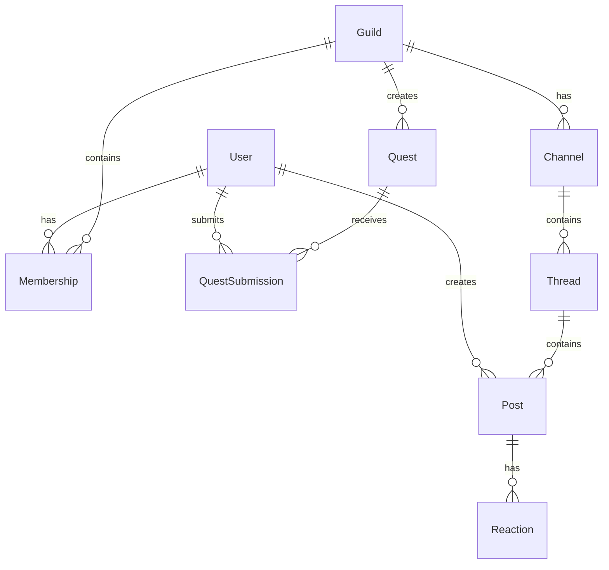

# Nova Agora - Supporter-Exclusive Guild Platform

[](https://www.typescriptlang.org/)
[](https://nextjs.org/)
[](https://www.prisma.io/)
[](https://trpc.io/)

## Overview

Nova Agora is a **supporter-exclusive community platform** designed for creators and their backers. Built with the T3 Stack, it enables project-based "guilds" where supporters can engage deeply through discussions, quests, and AI-curated content.

**Key Philosophy**: Community engagement through **BPES strategy** (Scarcity, Curiosity, Loss Aversion, Social Proof).

## Tech Stack

| Layer | Technology |
|-------|------------|
| **Frontend** | Next.js 15 (App Router), React 18, Tailwind CSS |
| **Backend** | tRPC, Next.js API Routes |
| **Database** | PostgreSQL, Prisma ORM |
| **Auth** | NextAuth.js (Email Magic Link, Discord OAuth) |
| **AI** | OpenAI GPT-4o-mini |
| **Caching** | Redis (optional) |
| **Testing** | Vitest |
| **Containerization** | Docker, Docker Compose |

## Domain Model Summary



**Core Entities**:
- **User**: Platform users with profiles and total points
- **Guild**: Project-based communities with invite codes
- **Membership**: User-guild relationship with roles (Admin/Elder/Member) and points
- **Channel**: Topic-based discussion areas within guilds
- **Thread**: Conversation threads within channels
- **Post**: User messages in threads or guild feeds
- **Quest**: Challenges with point rewards and deadlines
- **QuestSubmission**: User submissions for quests with review status
- **Reaction**: Post reactions (Like, Love, Insightful, Rocket, Eyes)

## Getting Started

### Requirements

- **Node.js** 20+ and npm 10+
- **Docker** and Docker Compose (recommended)
- **PostgreSQL** 16+ (or use Docker)
- **Redis** 7+ (optional, for caching)

### Quick Setup (Recommended)

```bash
# 1. Clone the repository
git clone <repository-url>
cd nova-agora-guild-platform

# 2. Install dependencies
npm install

# 3. Copy environment variables
cp .env.example .env

# 4. Start PostgreSQL and Redis with Docker
npm run docker:dev

# 5. Initialize database and seed demo data
npm run setup

# 6. Start development server
npm run dev
```

The app will be available at **http://localhost:3000**

### Manual Setup (Without Docker)

```bash
# 1. Install dependencies
npm install

# 2. Configure .env with your PostgreSQL connection
cp .env.example .env
# Edit .env and set DATABASE_URL

# 3. Push database schema
npm run db:push

# 4. Seed demo data
npm run db:seed

# 5. Start development
npm run dev
```

### Environment Variables

Copy `.env.example` to `.env` and configure:

**Required**:
- `DATABASE_URL`: PostgreSQL connection string
- `NEXTAUTH_SECRET`: Random secret for session encryption
- `NEXTAUTH_URL`: Your app URL (http://localhost:3000 for dev)

**Optional**:
- `DISCORD_CLIENT_ID` / `DISCORD_CLIENT_SECRET`: Discord OAuth
- `EMAIL_SERVER_*`: SMTP config for magic link auth
- `OPENAI_API_KEY`: For AI features (highlights, summaries)
- `REDIS_URL`: Redis connection for caching

## Available Scripts

| Command | Description |
|---------|-------------|
| `npm run dev` | Start development server |
| `npm run build` | Build for production |
| `npm start` | Start production server |
| `npm test` | Run tests with Vitest |
| `npm run test:ui` | Open Vitest UI |
| `npm run lint` | Run ESLint |
| `npm run db:push` | Push schema to database |
| `npm run db:migrate` | Run Prisma migrations |
| `npm run db:seed` | Seed demo data |
| `npm run db:studio` | Open Prisma Studio |
| `npm run db:reset` | Reset database (careful!) |
| `npm run docker:dev` | Start dev containers (Postgres + Redis) |
| `npm run docker:down` | Stop dev containers |
| `npm run docker:build` | Build production Docker image |
| `npm run docker:up` | Start production containers |
| `npm run setup` | Complete setup (install + push + seed) |

## Example Flow: End-to-End Vertical Slice

This implementation includes a complete **Guild Creation → Join → Post** flow:

### 1. Create a Guild

1. Sign in at http://localhost:3000
2. Navigate to Dashboard
3. Click "新規ギルド作成" (Create New Guild)
4. Fill in guild details:
   - Name: "Test Guild"
   - Description: "A test community"
   - Public/Private toggle
5. Submit → Redirected to guild feed

**Backend**: `guild.create` mutation in `src/server/api/routers/guild.ts`

### 2. Join a Guild via Invite Code

1. Go to Dashboard → "招待コードで参加" (Join via Invite)
2. Enter invite code (demo codes in seed data):
   - `INNOVATE2024` for Innovators Guild
   - `CREATE2024` for Creators Hub
3. Submit → Redirected to guild feed

**Backend**: `guild.joinByInvite` mutation

### 3. Post to Guild Feed

1. In guild feed (`/g/{slug}/feed`)
2. Type message in text area
3. Click "投稿" (Post)
4. See post appear in feed with reactions

**Backend**: `post.create` mutation in `src/server/api/routers/post.ts`

### 4. Explore Channels & Threads

1. Navigate to channel from left sidebar
2. Create thread with title and content
3. Reply to threads
4. React to posts

**Backend**:
- `thread.create` mutation
- `post.create` mutation (with threadId)
- `reaction.toggle` mutation

### 5. Complete a Quest

1. Go to Quests page (`/g/{slug}/quests`)
2. View active quests
3. Click quest to see details
4. Submit your work
5. Admin reviews and awards points

**Backend**:
- `quest.submit` mutation
- `quest.reviewSubmission` mutation (admin only)

## Demo Credentials

After running `npm run db:seed`, you can use these demo accounts:

| Email | Role in Innovators Guild | Points |
|-------|-------------------------|--------|
| alice@example.com | Admin | 150 |
| bob@example.com | Elder | 200 |
| carol@example.com | Member | 120 |
| dave@example.com | Member | 80 |

**Invite Codes**:
- Innovators Guild: `INNOVATE2024`
- Creators Hub: `CREATE2024`

**Note**: Use Email magic link auth (check console logs for magic links in dev mode)

## Testing

```bash
# Run all tests
npm test

# Run tests in watch mode
npm run test

# Open Vitest UI
npm run test:ui

# Run tests once (CI mode)
npm run test:run
```

**Test Coverage**:
- ✅ Utility functions (`formatDistanceToNow`, `slugify`)
- ✅ AI service structure validation
- 🚧 More API router tests (coming soon)

## Docker Deployment

### Development

```bash
# Start only PostgreSQL and Redis
npm run docker:dev

# Stop containers
npm run docker:down
```

### Production

```bash
# Build and start all services (app + db + redis)
npm run docker:build
npm run docker:up

# The app will be available at http://localhost:3000
```

**Note**: Update `.env` with production values before deploying.

## Project Structure

```
nova-agora-guild-platform/
├── prisma/
│   ├── schema.prisma          # Database schema
│   └── seed.ts                # Seed script with demo data
├── src/
│   ├── app/                   # Next.js App Router
│   │   ├── (authenticated)/   # Protected routes
│   │   │   ├── dashboard/     # User dashboard
│   │   │   ├── guild/         # Guild create/join pages
│   │   │   └── g/[guildSlug]/ # Guild-specific pages
│   │   │       ├── feed/      # Guild timeline
│   │   │       ├── quests/    # Quest list
│   │   │       └── c/[channelSlug]/  # Channel & threads
│   │   ├── api/               # API routes
│   │   │   ├── auth/          # NextAuth handlers
│   │   │   └── trpc/          # tRPC handlers
│   │   ├── auth/signin/       # Sign-in page
│   │   ├── layout.tsx         # Root layout
│   │   └── page.tsx           # Landing page
│   ├── server/
│   │   ├── api/
│   │   │   ├── routers/       # tRPC routers (7 files)
│   │   │   ├── root.ts        # Main router
│   │   │   └── trpc.ts        # tRPC config
│   │   ├── services/
│   │   │   └── openai.ts      # AI service
│   │   ├── auth.ts            # NextAuth config
│   │   ├── db.ts              # Prisma client
│   │   └── redis.ts           # Redis client
│   ├── trpc/
│   │   ├── react.tsx          # Client-side tRPC
│   │   └── server.ts          # Server-side tRPC
│   ├── lib/
│   │   └── utils.ts           # Helper functions
│   └── env.js                 # Env validation (t3-env)
├── Dockerfile                 # Production container
├── docker-compose.yml         # Production setup
├── docker-compose.dev.yml     # Development services
├── vitest.config.ts           # Test configuration
└── package.json
```

## BPES Strategy Implementation

### 🔒 Scarcity (希少性)

**Goal**: Make membership feel exclusive and valuable

- **Invite-only guilds**: `inviteCode` required to join
- **Role badges**: Visual hierarchy (Admin 👑, Elder ⭐, Member)
- **Point rankings**: Top contributors highlighted in sidebar
- **Limited quest slots**: Only 5 active quests shown prominently

**Implementation**:
- `prisma/schema.prisma`: `Guild.inviteCode`, `Membership.role`
- `src/server/api/routers/guild.ts`: `joinByInvite` mutation
- UI: Dashboard shows role badges, sidebar shows member rankings

### 🎯 Curiosity (好奇心)

**Goal**: Keep users coming back for new content

- **AI Weekly Highlights**: Auto-generated content summaries
- **Quest System**: New challenges with rewards
- **Thread Summaries**: One-click AI summaries of long discussions

**Implementation**:
- `src/server/services/openai.ts`: `generateWeeklyHighlights`, `summarizeThread`
- `src/server/api/routers/post.ts`: `generateWeeklyHighlights` mutation
- UI: Pinned AI highlights with special badge

### ⏰ Loss Aversion (損失回避)

**Goal**: Create urgency and fear of missing out

- **Quest Deadlines**: Time-limited challenges
- **Point Competition**: See others pulling ahead
- **Streak Systems**: (Future) Maintain activity streaks

**Implementation**:
- `prisma/schema.prisma`: `Quest.deadline`
- `src/server/api/routers/quest.ts`: Deadline validation
- UI: Quest page shows deadline countdown, expired quests marked

### 👥 Social Proof (社会的証明)

**Goal**: Show active, engaged community

- **Member Count**: Visible on guild cards
- **Reaction Counts**: Show popular posts
- **Activity Feed**: Real-time guild timeline
- **Top Contributors**: Sidebar member list sorted by points

**Implementation**:
- UI: Dashboard displays member counts per guild
- `src/server/api/routers/reaction.ts`: Aggregates reactions
- UI: Right sidebar shows active members with point totals

## API Documentation

All APIs are fully type-safe via **tRPC**. No manual type definitions needed.

### Main Routers

- `guild`: CRUD operations, feed, invite management
- `membership`: Member roles, profiles, point awards
- `channel`: Channel management within guilds
- `thread`: Thread creation, pinning, locking
- `post`: Posts, AI summaries, weekly highlights
- `quest`: Quest CRUD, submissions, reviews
- `reaction`: Toggle reactions on posts

**Example Usage** (Client):

```typescript
// Get guild by slug
const { data: guild } = api.guild.getBySlug.useQuery({ slug: "innovators-guild" });

// Create a post
const createPost = api.post.create.useMutation();
createPost.mutate({ guildId: "xxx", content: "Hello!" });

// Join guild via invite
const joinGuild = api.guild.joinByInvite.useMutation();
joinGuild.mutate({ inviteCode: "INNOVATE2024" });
```

## Future Extensions

1. **Real-time Notifications**: Redis Pub/Sub + WebSocket
2. **File Uploads**: AWS S3 or Cloudflare R2 integration
3. **Live Chat**: WebSocket-based real-time messaging
4. **Crowdfunding Integration**: Campfire/Kickstarter API sync
5. **Achievement Badges**: Gamification system
6. **Mobile App**: React Native wrapper
7. **Analytics Dashboard**: Member engagement metrics
8. **Multi-language Support**: i18n for global communities
9. **Moderation Tools**: Auto-mod, report system
10. **Voice/Video Channels**: WebRTC integration

## Contributing

Contributions are welcome! Please follow these steps:

1. Fork the repository
2. Create a feature branch (`git checkout -b feature/amazing-feature`)
3. Commit changes (`git commit -m 'Add amazing feature'`)
4. Push to branch (`git push origin feature/amazing-feature`)
5. Open a Pull Request

**Development Guidelines**:
- Write tests for new features
- Follow existing code style
- Update documentation as needed
- Ensure `npm run lint` passes

## License

MIT License - see LICENSE file for details

## Acknowledgments

- Built with [T3 Stack](https://create.t3.gg/)
- Inspired by Discord, Patreon, and community-first platforms
- BPES strategy adapted from behavioral economics research

---

**Questions or Issues?** Open an issue on GitHub or contact the maintainers.
